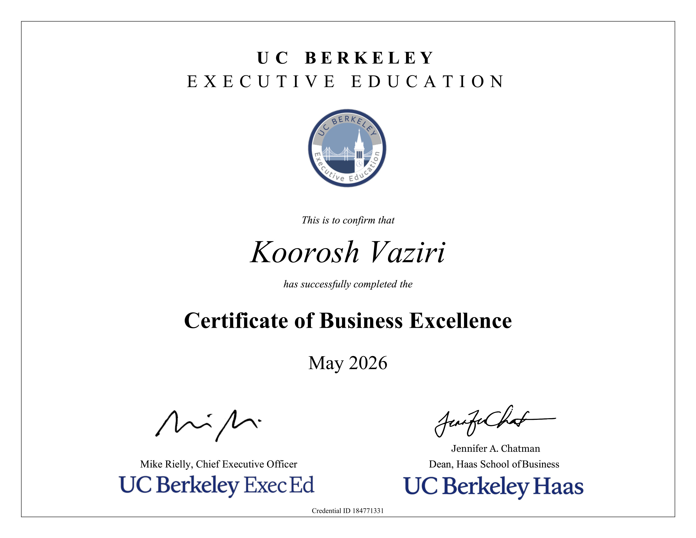

# 🏆 UC Berkeley Certificate of Business Excellence (COBE)

### Executive Leadership, Innovation, and Strategy

This repository serves as the capstone for my **[Certificate of Business Excellence](https://executive.berkeley.edu/certificate-business-excellence)** from **UC Berkeley Haas School of Business and UC Berkeley Executive Education**. The COBE is an elite credential highly regarded as a more focused Executive MBA awarded to leaders who complete all curriculum requirements within 3 years across four academic pillars.

### 🎓 Berkeley Haas Alumni

I was awarded the official certificate and granted **UC Berkeley Haas Executive Alumnus** status as of May 2026.

### 🚀 **Program Capstone:** 

Developed the business strategy and technical blueprint for **SONERAMIC**, an AI-driven spatial computing platform utilizing ultrasonic and LiDAR digital twins to disrupt acoustic calibration standards.
* **SONERAMIC Presentation:** [Soneramic Capstone Slides](https://github.com/kooroshvaziri/Berkeley_COBE/blob/main/SONERAMIC/berkeley_haas_cobe_capstone_soneramic_by_kooroshvaziri.pdf)

---

### 🏛️ Academic Pillars & Completed Curriculum

> #### 1. Strategy & Management
> - 📊 **[Data Strategy: Leveraging Data as a Competitive Advantage](https://github.com/kooroshvaziri/Berkeley_Data_Strategy)** — *Building data assets and flywheels.*
> - 🌐 **[Digital Transformation: Leading People, Data, and Technology](https://github.com/kooroshvaziri/Berkeley_Digital_Transformation)** — *Process optimization through Swimlane mapping, two sided markets, executive culture, market disruptions, and network effects.*
> #### 2. Entrepreneurship & Innovation
> - 🧬 **[Data Science: Machine Learning and Artificial Intelligence](https://github.com/kooroshvaziri/Berkeley_AIML)** — *Data Science intensive program covering core statistical theory, predictive modeling, machine learning architecture, neural networks, and advanced time-series analysis.*
> - 🎯 **[Product Management Studio](https://github.com/kooroshvaziri/Berkeley_Product_Management_Studio)** — *Product Strategy, Market Analysis, Customer Journeys, and Lifecycle Roadmapping.*
> #### 3. Finance & Business Acumen
> - 🏦 **[FinTech: Frameworks, Applications, and Strategies](https://github.com/kooroshvaziri/Berkeley_FinTech)** — *Decentralized applications, cryptographic assets, and automated economic strategies.*
> #### 4. Leadership & Communication
> - 👥 **[Leading Strategy Execution through Culture](https://github.com/kooroshvaziri/Berkeley_Leading_Strategy_Execution_through_Culture)** — *Organizational Leadership, Alignment, and High-Performance Engineering Culture.*

---

*UC Berkeley Haas School of Business Certificate of Business Excellence*
